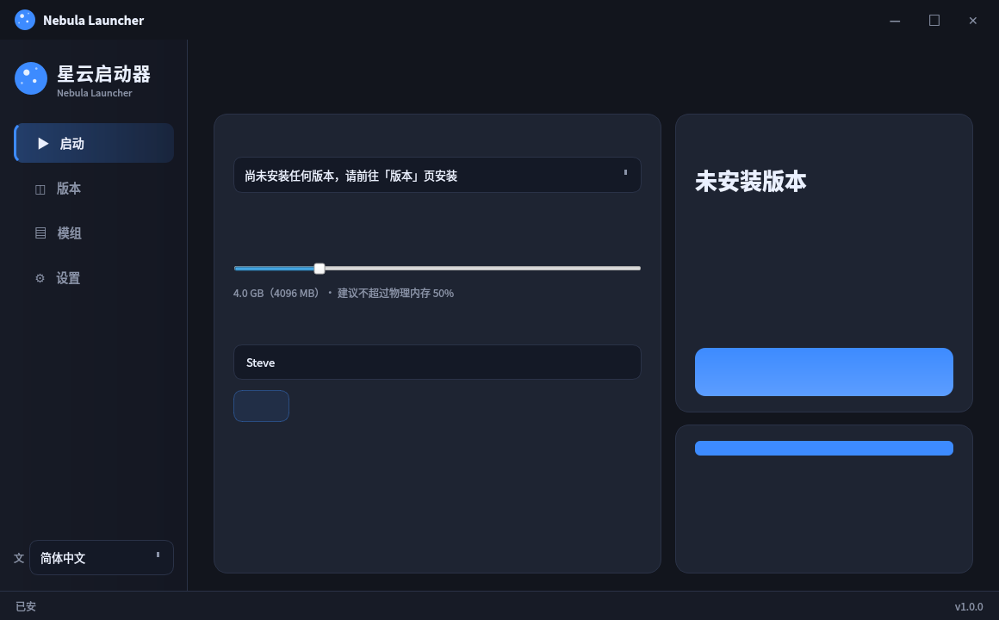

# Nebula Launcher · 星云启动器

一个优雅、流畅、真正可用的 Minecraft Java 版启动器，界面仿照 PCL（Plain Craft Launcher），支持 **22 种语言**，内置模组中心与内存优化。



## ✨ 特性

- 🎨 **PCL 风格界面**：左侧导航 + 卡片布局，深蓝主题，开箱即用
- 🌐 **22 种界面语言**：中 / 英 / 日 / 韩 / 法 / 德 / 西 / 俄 / 葡 / 意 / 波 / 荷 / 土 / 越 / 泰 / 印尼 / 乌 / 印地 / 阿 / 马来 / 菲律宾 / 繁中
- 🧩 **全加载器支持**：原版（Vanilla）、Fabric、Quilt、Forge 一键安装
- 📦 **模组中心**：连接 GitHub Releases 模组仓库 + Modrinth 官方源，按需下载
- 🗃 **整合包一键装**：连接 Modrinth 海量整合包（Fabulously Optimized 等），或本地导入 zip / mrpack，自动解析安装
- 🌅 **光影支持**：Modrinth 光影搜索下载（Complementary 等），安装到 shaderpacks 目录
- 👤 **三种账号**：正版微软登录 / 离线账号 / **自定义服务器账号**（authlib-injector，输入服务器地址 + 账号 + 密码即可获取皮肤与披风）
- ⚡ **内存优化**：内置 Aikar's Flags（G1GC 调优等），防内存流失、提升帧率
- 🚀 **一键起飞**：启动游戏后自动关闭启动器，只让 Minecraft 单独运行
- 🔄 **多镜像源**：官方 Mojang 源 + BMCLAPI 镜像，国内也能快速下载
- ☕ **Java 自动管理**：自动检测/下载对应版本 Java（Temurin）

## 📱 Android 手机版（APK）

Release 提供 `NebulaLauncher-Android-v1.1.0.apk`——基于开源 **PojavLauncher v3_openjdk** 构建的 Minecraft Java 版 Android 运行端：

- **32 位 / 64 位全支持**：armeabi-v7a（老手机）、arm64-v8a（现代手机）、x86 / x86_64（模拟器如 BlueStacks、雷电、MuMu）
- **游戏与模组存于内部存储**：`.minecraft` 目录（Android/data/net.kdt.pojavlaunch/ 或应用私有目录，Android 11+ 按系统分区规则）
- **账号体系**：正版微软登录 / 离线账号 / **自定义服务器（authlib-injector：服务器地址 + 账号 + 密码 → 皮肤与披风）**
- 启动流畅、低内存占用，支持光影与整合包（首次启动自动下载对应 JRE 运行栈）
- 安装：设置中允许"安装未知来源应用"，直接安装 APK 即可

## 🚀 快速开始

```bash
# 1. 安装依赖
pip install -r requirements.txt

# 2. 启动（单文件入口）
python main.py
```

> 需要 Python 3.10+。Java 可以由启动器自动下载（正版需微软账号，离线可任意昵称）。

## 📦 打包为可执行文件

- **Windows**：双击 `build_windows.bat`（需已安装 Python + PyInstaller）
- **Linux/macOS**：运行 `bash build_linux.sh`

打包产物在 `dist/` 目录。

## 🗂 项目结构

```
NebulaLauncher/
├── main.py                  # 唯一入口
├── launcher/
│   ├── minecraft/           # 版本清单、安装、启动、Fabric/Forge
│   ├── mods/                # 模组源（GitHub Releases / Modrinth）
│   └── ui/                  # PCL 风格界面
├── i18n/                    # 22 种语言文件
├── website/                 # 官网静态资源
├── index.html               # 官网（GitHub Pages 部署）
└── tools/                   # 构建辅助脚本
```

## 🧩 模组仓库

模组分发走 GitHub Releases：[NebulaLauncher-Mods](https://github.com/et2416444244/NebulaLauncher-Mods)

1. 在模组仓库创建 Release，把 `.jar` 模组文件作为附件上传
2. 启动器「模组中心 → GitHub Releases」页签会自动拉取并显示
3. 玩家点击「安装」即可下载到 `.minecraft/mods/`

## 🔒 安全说明

- 启动参数内置 `-Dlog4j2.formatMsgNoLookups=true`（Log4Shell 防护）
- 离线模式不会收集任何个人信息

## 📄 开源协议

MIT License

---

*Minecraft 是 Mojang AB 的商标。本项目与 Mojang / Microsoft 无隶属关系，也不属于官方产品。*
